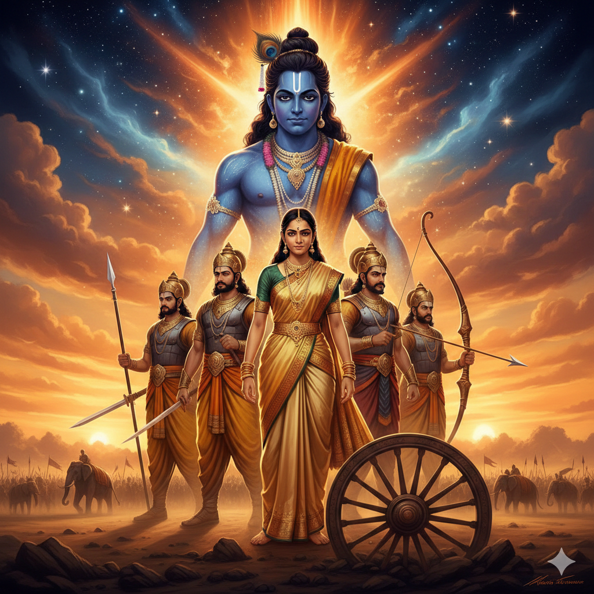
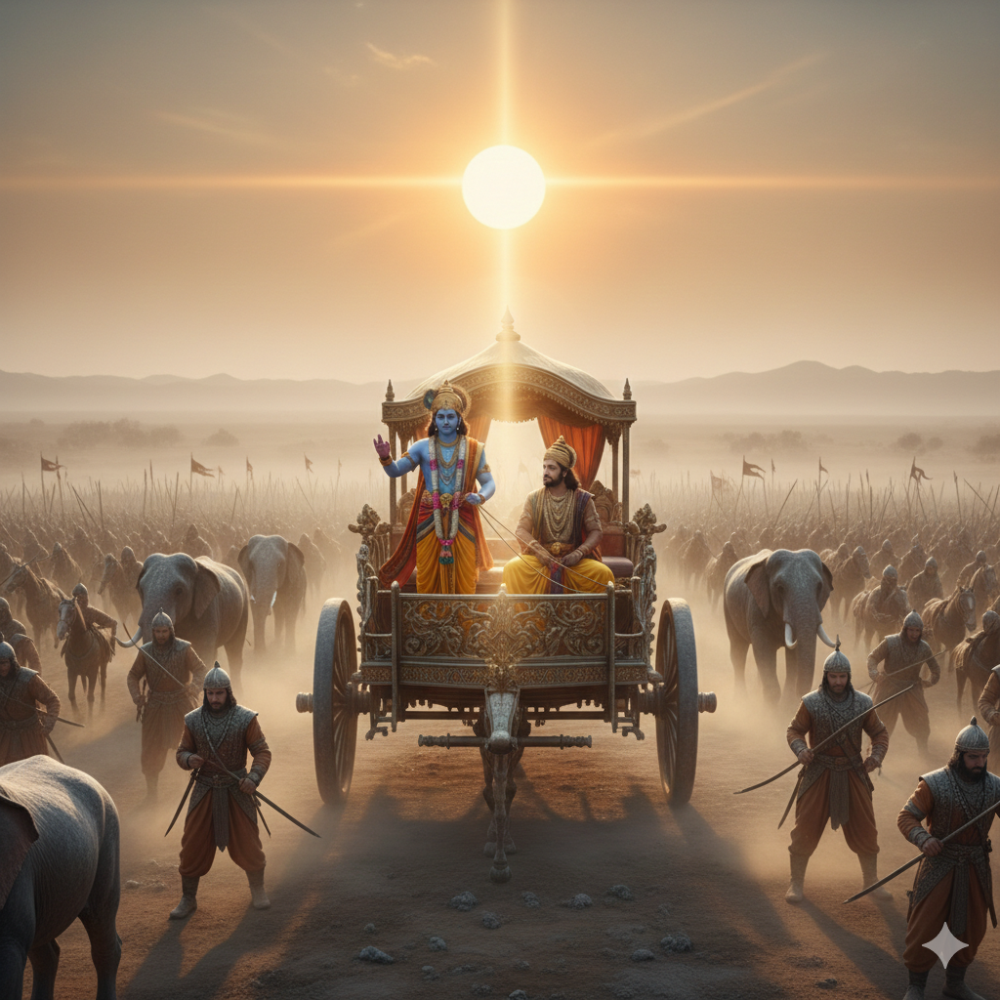
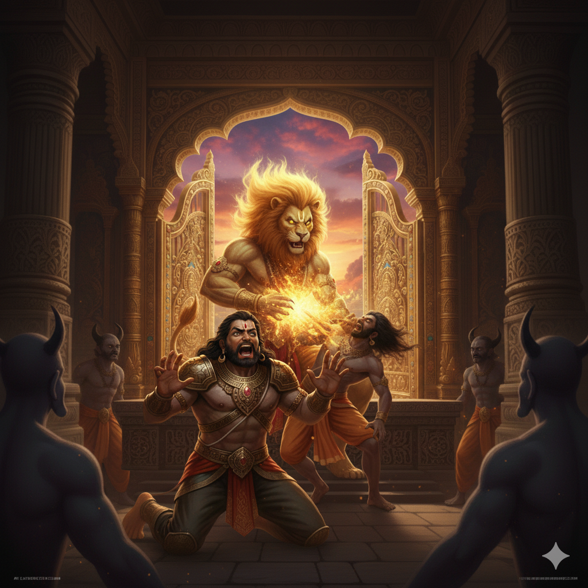
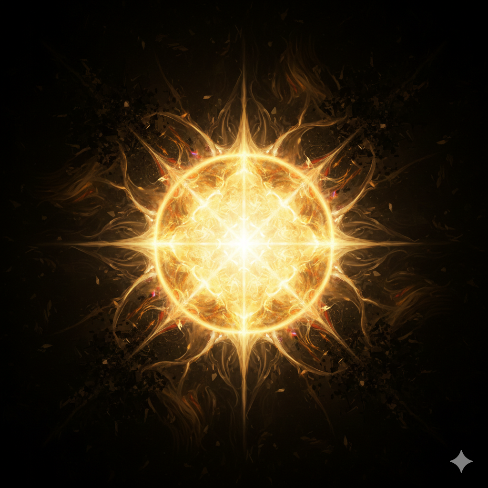

<div align="center">
  
  <br />
  <br />

  <h1>🕉️ Story Telling Web (Divine Epics Interactive)</h1>
  
  <p>
    <strong>An immersive, interactive digital journey through the timeless epics of India.</strong><br/>
    <em>Experience the Ramayan 🏹, Mahabharat ⚔️, Radha Krishna 🦚, and Mahavatar Narasimha 🦁 with immersive audio 🎧 & stunning visuals 💎.</em>
  </p>

  <p>
    <a href="#-key-features"><strong>🌟 Features</strong></a> ·
    <a href="#-epics-included"><strong>📖 Epics</strong></a> ·
    <a href="#-tech-stack"><strong>🛠️ Tech Stack</strong></a> ·
    <a href="#-getting-started"><strong>🚀 Getting Started</strong></a>
  </p>

  <p>
    
    
    
    
  </p>
</div>

---

## 🌟 Project Vision

**Story Telling Web** serves as a digital gateway to ancient wisdom, blending modern web technologies with spiritual storytelling. Our vision is to preserve India's cultural heritage by making these timeless tales engaging for all generations through gamification, emotional audioscapes, and exquisite visual artistry.

---

## ✨ Key Features

- **🌌 Immersive Atmosphere**: Context-aware ambient background music (BGM) 🎵 and dynamic light rays create a deeply spiritual and emotional mood.
- **📖 Interactive Story Cards**: Detailed storytelling cards covering epic milestones, characters 👥, locations 📍, and eras ⏳. Each card features stunning artwork and engaging facts.
- **🌐 Multi-Language Support**: Seamlessly switch between **English**, **Hindi (हिंदी)**, and **Odia (ଓଡ଼ିଆ)** to learn in your preferred language.
- **🎮 Engaging & Interactive**: Scroll progress tracking, delightful hover animations, and smooth page transitions built with Framer Motion.
- **📱 Responsive & PWA Ready**: A fluid experience optimized for all devices. Installable as a native app on your desktop and mobile devices for a seamless experience.
- **💎 Modern UI**: Beautifully crafted with glassmorphism, tailored typography, custom scrollbars, and gorgeous color themes referencing our heritage.

---

## 📖 Epics Included

### 🏹 The Ramayan

A saga of righteousness (`Dharma`), courage, and devotion. Follow the 15-chapter journey of Lord Rama, from his divine birth in Ayodhya, the exile in the forest, building the Ram Setu, to the final victorious battle.

<details>
<summary><strong>Explore Ramayan Chapters</strong></summary>

1. The Birth of Rama
2. Sita's Swayamvar
3. The Exile to the Forest
4. The Golden Deer
5. Sita's Kidnapping
6. Meeting Hanuman
7. Hanuman's Leap to Lanka
8. Hanuman Burns Lanka
9. Building the Bridge
10. The Great Battle Begins
11. Lakshmana Falls
12. Rama vs Ravana
13. The Victorious Return
14. The Golden Age - Ram Rajya
15. Lessons from the Ramayana
</details>

#### Visuals from the Saga

|                                          Birth of Lord Rama                                          |                                      Building the Ram Setu                                       |
| :--------------------------------------------------------------------------------------------------: | :----------------------------------------------------------------------------------------------: |
|  |  |

### ⚔️ The Mahabharat

The Greatest Epic of All Time. A saga of duty, war, and righteousness. Experience the epic story of Kurukshetra, the conflict between the Pandavas and Kauravas, and the divine wisdom of the Bhagavad Gita as Lord Krishna guides Arjuna.

#### Visuals from the Saga

|                                                 The Kurukshetra War                                                 |                                            The Supreme Knowledge                                             |
| :-----------------------------------------------------------------------------------------------------------------: | :----------------------------------------------------------------------------------------------------------: |
|  |  |

### 🦁 Mahavatar Narasimha

The Divine Protector. The fierce half-man, half-lion incarnation of Lord Vishnu who descends to protect his greatest devotee, Prahlada, and slay the demon king Hiranyakashipu, proving that faith triumphs over fear.

#### Visuals from the Saga

|                                                  Narasimha Appears                                                   |                                             The Divine Form                                              |
| :------------------------------------------------------------------------------------------------------------------: | :------------------------------------------------------------------------------------------------------: |
|  |  |

### 🦚 Radha Krishna

The divine poetry of eternal love, bliss, and supreme consciousness. Dive into the beautiful leelas of Lord Krishna, from his enchanting childhood in Vrindavan to the eternal spiritual bond with Radha.

#### Visuals from the Saga

|                                         The Divine Flute                                         |                                                The Butter Thief                                                |
| :----------------------------------------------------------------------------------------------: | :------------------------------------------------------------------------------------------------------------: |
|  |  |

---

## 📚 Documentation & Guides

The project features extensive documentation. Explore the [`/docs`](./docs) folder for detailed guides:

- **[Project Analysis](./docs/PROJECT_ANALYSIS.md)**: Deep dive into the framework, architecture, tech dependencies, and component design of the Divine Epics platform.
- **[Integration Complete](./docs/INTEGRATION_COMPLETE.md)**: Details on the integration of the four epics, their components, and routes.
- **[Image Guidance](./docs/IMAGE_GUIDE.md)**: Specs, prompts, and instructions for managing the high-quality assets.
- **[Troubleshooting](./docs/TROUBLESHOOTING.md)**: Debugging details for Large File Storage and server deployments.
- **[GitHub Details](./docs/GITHUB_DETAILS.md)**: Specifics on maintaining repository metadata for discoverability.

---

## 🛠️ Tech Stack

Built with ❤️ using the best modern web technologies:

- **Framework**: `Next.js 14/16` (App Router)
- **Styling**: `Tailwind CSS 4.x` (Utility-first styling & Animations)
- **Language**: `TypeScript` (Strict Type Safety)
- **UI & Animations**: `Framer Motion` (Transitions) & `shadcn/ui` based components
- **Icons**: `Lucide React`
- **Audio Generation & Multimedia**: Contextual BGM handling, HTML5 Audio

---

## 🚀 Getting Started

### Prerequisites

- Node.js 18.x or later
- npm or yarn

### 1. Clone the repository

```bash
git clone https://github.com/yourusername/story-telling-web.git
cd story-telling-web
```

### 2. Install dependencies

```bash
npm install
# or
yarn install
```

### 3. Run the development server

```bash
npm run dev
```

Open [http://localhost:3000](http://localhost:3000) in your browser to experience the storytelling web app.  
Switch between stories by navigating to `/ramayan`, `/mahabharat`, `/narasimha`, and `/radha-krishna`, or by selecting the respective story buttons on the landing page!

---

## 🤝 Contributing

Contributions are warmly welcome! If you'd like to improve the translations, add more stories, enhance the UI, or expand the interactivity features:

1. Fork the repository
2. Create a new branch (`git checkout -b feature/amazing-feature`)
3. Commit your changes (`git commit -m 'Add amazing feature'`)
4. Push to the branch (`git push origin feature/amazing-feature`)
5. Open a Pull Request

---

## 🌟 Acknowledgements

_Dedicated to preserving our **Cultural Heritage** for modern generations._ 🙏  
_Developed with ❤️ by **Basudev** and contributors._

> **"Dharmo Rakshati Rakshitah"**  
> _Righteousness Protects Those Who Protect It_
